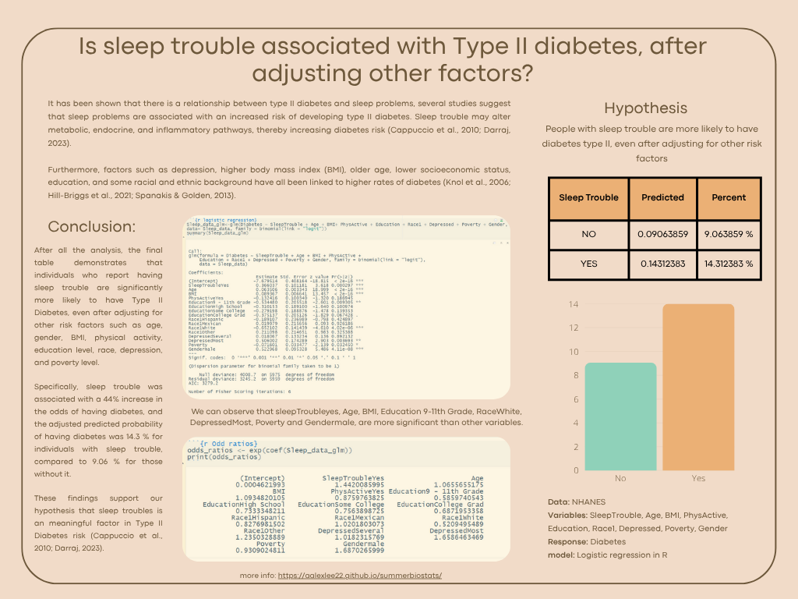

---
output:
  html_notebook: default
  pdf_document: default
  word_document: default
---
# WHAT IS NHANES?

The NHANES survey is conducted by the US CDC. [More about NHANES](https://www.cdc.gov/nchs/nhanes/about/index.html). These surveys have been conducted since the 1960’s.

Starting in 1999, about 5,000 individuals of all ages have been interviewed every year and then they complete the health examination component of the survey. Part of this dataset is made available via the NHANES package which can be loaded this way:

```{r data}
data(NHANES) 
dim(NHANES)
```
Before we start, it is necessary run the packages that we are going to use, in this case would be: 

```{r setup}
library(tidyverse)
library(gtsummary)
library(NHANES)
library(ggplot2)
library(scales)
library(gganimate)
```


## **Is sleep trouble associated with Type II diabetes, after adjusting other factors?**

It has been shown that there is a relationship between type II diabetes and sleep problems, several studies suggest that sleep problems are associated with an increased risk of developing type II diabetes. Sleep trouble may alter metabolic, endocrine, and inflammatory pathways, thereby increasing diabetes risk (Cappuccio et al., 2010; Darraj, 2023).

Furthermore, factors such as depression, higher body mass index (BMI), older age, lower socioeconomic status, education, and some racial and ethnic background have all been linked to higher rates of diabetes (Knol et al., 2006; Hill-Briggs et al., 2021; Spanakis & Golden, 2013). 

### Hypothesis

People with sleep trouble are more likely to have diabetes type II, even after adjusting for other risk factors

### Preparing the data

Select only the data that we will use.

```{r clean data}
NHANES %>% select(Diabetes, SleepTrouble, Age, BMI, PhysActive, Education, Race1, Depressed, Poverty, Gender)
Sleep_data <-NHANES %>% select(Diabetes, SleepTrouble, Age, BMI, PhysActive, Education, Race1, Depressed, Poverty, Gender) %>% filter(!is.na(Diabetes),!is.na(SleepTrouble), !is.na(Age), !is.na(BMI), !is.na(Education), !is.na(Race1),  !is.na(Depressed), !is.na(Poverty),!is.na(Gender))
summary(Sleep_data)

```

### Exploratory graphs by variable

To have an overview of the relationship between diabetes and other factors, a graphic model of each of them was created.


```{r Exploratory graphs by variable}


Sleep_data %>%  
  ggplot(aes(x=SleepTrouble, fill= Diabetes )) + 
  geom_bar(position="fill") + 
  scale_y_continuous(labels = scales::percent) + 
  labs(
  y = "Proportion", 
  title = "Prevalence of Type II Diabetes by Sleep Trouble",
    subtitle = "Based on NHANES Data",
    x = "Sleep Trouble",
    y = "Proportion",
    fill = "Diabetes Status",
    caption = "Figure 1") +
  theme_minimal() +
  scale_fill_manual(values = c("No" = "darkgoldenrod1",  
                               "Yes" = "cornflowerblue")) +  
  theme(
    plot.title = element_text(hjust = 0.5,  color = "deepskyblue4", size = 16, face = "bold"),
    plot.subtitle = element_text(hjust = 0.5, color = "gray30", size = 12),
    plot.caption = element_text(hjust = 1,  color = "gray50", size = 10, face = "italic")
  )


Sleep_data %>%
  ggplot(aes(x = Diabetes, y = Age, fill = Diabetes)) +
  geom_boxplot() +
  labs(
    title = "Distribution of Age by Diabetes Status",
    subtitle = "Based on NHANES Data",
    x = "Diabetes",
    y = "Age (years)",
    fill = "Diabetes",
    caption = "Figure 2") +
  theme_minimal() +
  scale_fill_manual(values = c("No" = "darkgoldenrod1", "Yes" = "cornflowerblue")) +
  theme(
    plot.title = element_text(hjust = 0.5, color = "deepskyblue4", size = 16, face = "bold"),
    plot.subtitle = element_text(hjust = 0.5, color = "gray30", size = 12),
    plot.caption = element_text(hjust = 1, color = "gray50", size = 10, face = "italic")
  )


Sleep_data %>%  
  ggplot(aes(x=Diabetes, y=BMI, fill= Diabetes )) + 
  geom_boxplot()+ 
  labs( 
    title = "Percentage of BMI by Diabetes II patients",
    subtitle = "Based on NHANES Data",
    x = "Diabetes",
    y = "BMI",
    fill = "Diabetes",
    caption = "Figure 3") +
  theme_minimal() +  
    scale_fill_manual(values = c("No" = "darkgoldenrod1",  
                               "Yes" = "cornflowerblue")) + 
  theme(
    plot.title = element_text(hjust = 0.5,  color = "deepskyblue4", size = 16, face = "bold"),
    plot.subtitle = element_text(hjust = 0.5, color = "gray30", size = 12),
    plot.caption = element_text(hjust = 1,  color = "gray50", size = 10, face = "italic")
  )


Sleep_data %>%  
  ggplot(aes(x=PhysActive, fill= Diabetes)) + 
  geom_bar() + 
  labs(
    y = "count", 
    title = "Prevalence of Type II Diabetes by Physical Activity",
    subtitle = "Based on NHANES Data",
    x = "PhysActive",
    y = "count",
    fill = "Diabetes Status",
    caption = "Figure 4") +
  theme_minimal()  +
  scale_fill_manual(values = c("No" = "darkgoldenrod1",  
                               "Yes" = "cornflowerblue")) +  
  theme(
    plot.title = element_text(hjust = 0.5,  color = "deepskyblue4", size = 16, face = "bold"),
    plot.subtitle = element_text(hjust = 0.5, color = "gray30", size = 12),
    plot.caption = element_text(hjust = 1,  color = "gray50", size = 10, face = "italic")
  )


Sleep_data %>% 
  ggplot(aes(x = Education, fill = Diabetes)) + 
  geom_bar(position = "fill") + 
  scale_y_continuous(labels = scales::percent) + 
  labs(
    y = "Proportion", 
    title = "Percentage of Diabetes II patients by Education Level",
    subtitle = "Based on NHANES Data",
    x = "Education",
    y = "Proportion",
    fill = "Diabetes Status",
    caption = "Figure 5")+
  theme_minimal()  +
  scale_fill_manual(values = c("No" = "darkgoldenrod1",  
                               "Yes" = "cornflowerblue")) +  
  theme(
    plot.title = element_text(hjust = 0.5,  color = "deepskyblue4", size = 16, face = "bold"),
    plot.subtitle = element_text(hjust = 0.5, color = "gray30", size = 12),
    plot.caption = element_text(hjust = 1,  color = "gray50", size = 10, face = "italic")
  )


Sleep_data %>% 
  ggplot(aes(x = Race1, fill = Diabetes)) + 
  geom_bar(position = "fill") + 
  scale_y_continuous(labels = scales::percent) + 
  labs(
    y = "Proportion", 
    title = "Percentage of Diabetes II patients by Race",
    subtitle = "Based on NHANES Data",
    x = "Race1",
    y = "Proportion",
    fill = "Diabetes Status",
    caption = "Figure 6") +
  theme_minimal()  +
  scale_fill_manual(values = c("No" = "darkgoldenrod1",  
                               "Yes" = "cornflowerblue")) +  
  theme(
    plot.title = element_text(hjust = 0.5,  color = "deepskyblue4", size = 16, face = "bold"),
    plot.subtitle = element_text(hjust = 0.5, color = "gray30", size = 12),
    plot.caption = element_text(hjust = 1,  color = "gray50", size = 10, face = "italic")
  )


Sleep_data %>%  ggplot(aes(x=Depressed, fill= Diabetes)) + 
  geom_bar(position="fill") + 
  scale_y_continuous(labels = scales::percent) + 
  labs(y = "Proportion", 
       title = "Prevalence of Type II Diabetes by Depression Status",
       subtitle = "Based on NHANES Data",
    x = "Depressed",
    y = "Proportion",
    fill = "Diabetes Status",
    caption = "Figure 7")+
  theme_minimal()  +
  scale_fill_manual(values = c("No" = "darkgoldenrod1",  
                               "Yes" = "cornflowerblue")) +  
  theme(
    plot.title = element_text(hjust = 0.5,  color = "deepskyblue4", size = 16, face = "bold"),
    plot.subtitle = element_text(hjust = 0.5, color = "gray30", size = 12),
    plot.caption = element_text(hjust = 1,  color = "gray50", size = 10, face = "italic")
  )


Sleep_data %>%  ggplot(aes(x= Diabetes, y=Poverty, fill= Diabetes)) + 
  geom_boxplot()  + 
  labs(
    x= "Diabetes",
    y = "Poverty lvl", 
    title = " Prevalence of Income Level by Type II Diabetes",
    subtitle = "Based on NHANES Data",
    x = "Diabetes",
    y="Poverty",
    fill = "Diabetes Status",
    caption = "Figure 8") +
  theme_minimal() +  
    scale_fill_manual(values = c("No" = "darkgoldenrod1",  
                               "Yes" = "cornflowerblue")) + 
  theme(
    plot.title = element_text(hjust = 0.5,  color = "deepskyblue4", size = 16, face = "bold"),
    plot.subtitle = element_text(hjust = 0.5, color = "gray30", size = 12),
    plot.caption = element_text(hjust = 1,  color = "gray50", size = 10, face = "italic")
  )


Sleep_data %>%  ggplot(aes(x=Gender, fill= Diabetes)) + 
  geom_bar()  + 
  labs(
    y = "count", 
    title = " Prevalence of Type II Diabetes by Gender",
    subtitle = "Based on NHANES Data",
    x = "Gender",
    y = "count",
    fill = "Diabetes Status",
    caption = "Figure 9") +
  theme_minimal() +  
    scale_fill_manual(values = c("No" = "darkgoldenrod1",  
                               "Yes" = "cornflowerblue")) + 
  theme(
    plot.title = element_text(hjust = 0.5,  color = "deepskyblue4", size = 16, face = "bold"),
    plot.subtitle = element_text(hjust = 0.5, color = "gray30", size = 12),
    plot.caption = element_text(hjust = 1,  color = "gray50", size = 10, face = "italic")
  )

```

## Run logistic regression model

```{r logistic regression}
Sleep_data_glm<-glm(Diabetes ~ SleepTrouble + Age + BMI+ PhysActive + Education + Race1 + Depressed + Poverty + Gender, data= Sleep_data, family = binomial(link = "logit"))
summary(Sleep_data_glm)
```
```{r Odd ratios}
odds_ratios <- exp(coef(Sleep_data_glm))
print(odds_ratios)
```
```{r getting percent of OR}


percent_change <- (odds_ratios-1)*100
print(round(percent_change, 2))

```


```{r Predicted model}
Sleep_data <- Sleep_data %>%
  mutate(predicted = predict(Sleep_data_glm, newdata = Sleep_data, type = "response"))

final_table <- Sleep_data %>%
  group_by(SleepTrouble) %>%
  summarise(predicted = mean(predicted, na.rm = TRUE)) %>%
  mutate(percent = predicted * 100)

final_table
```


```{r Final graph}
Sleep_data %>% group_by(SleepTrouble) %>%
  summarise(prob = mean(predicted, na.rm = TRUE)) %>%
  ggplot(aes(x = SleepTrouble, y = prob)) + 
  geom_col(fill = "cornflowerblue") + 
  labs(
    y = "Predicted Probability", 
    title = "Estimated Probability of Type II Diabetes by Sleep Trouble",
    caption = "Figure 10") + 
  theme_minimal() +  
  theme(
    plot.title = element_text(hjust = 0.5,  color = "deepskyblue4", size = 16, face = "bold"),
    plot.subtitle = element_text(hjust = 0.5, color = "gray30", size = 12),
    plot.caption = element_text(hjust = 1,  color = "gray50", size = 10, face = "italic")
  )
```


## **Interpretation:**

After all the analysis, the final table demonstrates that individuals who report having sleep trouble are significantly more likely to have Type II Diabetes, even after adjusting for other risk factors such as age, gender, BMI, physical activity, education level, race, depression, and poverty level.

Specifically, sleep trouble was associated with a 44% increase in the odds of having diabetes, and the adjusted predicted probability of having diabetes was 14.3 % for individuals with sleep trouble, compared to 9.06 % for those without it.

These findings support our hypothesis that sleep troubles is an meaningful factor in Type II Diabetes risk (Cappuccio et al., 2010; Darraj, 2023).


## **Poster**

